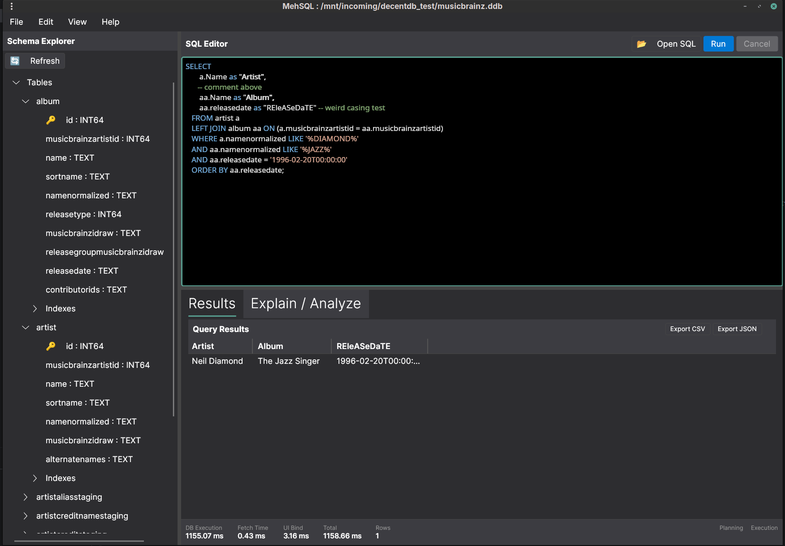

<div align="center">
  
  <h1>MehSQL</h1>
  <p><strong>Serious SQL tool. Casual attitude.</strong></p>
  <p>
    <a href="#features">Features</a> •
    <a href="#installation">Installation</a> •
    <a href="#usage">Usage</a> •
    <a href="#development">Development</a> •
    <a href="#license">License</a>
  </p>
  
  
  
</div>

---

<p align="center">
    
</p>

## Features

- 🚀 **Fast & Lightweight** – Built for speed, not bloat
- 📊 **Virtualized Results** – Handles 100k+ rows without breaking a sweat
- ⏱️ **Performance Transparency** – See exactly where time is spent (DB, fetch, UI)
- 🎨 **Clean UI** – Light/dark themes with a no-nonsense interface
- 💡 **SQL Autocomplete** – Context-aware suggestions for tables, columns, and keywords
- ⌨️ **Keyboard First** – Power-user shortcuts for everything
- 📝 **Query History** – Per-database history with quick recall
- 📤 **Export** – Stream results to CSV or JSON

---

## Installation

### Prerequisites

- [.NET 10.0 SDK](https://dotnet.microsoft.com/download) or later
- DecentDB (embedded database engine)

### From Source

```bash
git clone https://github.com/sphildreth/mehsql.git
cd mehsql
dotnet build
```

### Download

Pre-built binaries coming soon for:
- Windows (x64, ARM64)
- macOS (Intel, Apple Silicon)
- Linux (x64, ARM64)

---

## Usage

### Quick Start

1. Launch MehSQL
2. Open a DecentDB database file (`.db` or `.ddb`)
3. Start writing SQL
4. Press `Ctrl+Enter` (or `Cmd+Enter` on macOS) to execute

### Command-Line Usage

Open a database file directly from the command line:

```bash
# Open a DecentDB database file
./mehsql /path/to/database.ddb

# Or with dotnet run
dotnet run --project src/MehSql.App -- /path/to/database.ddb

# Load a database and SQL file together
./mehsql /path/to/database.ddb /path/to/query.sql
```

The application will automatically:
- Load and open the specified database file
- Refresh the schema explorer
- Load any `.sql` files into the query editor

### Keyboard Shortcuts

| Action | Windows/Linux | macOS |
|--------|---------------|-------|
| Execute Query | `Ctrl+Enter` | `Cmd+Enter` |
| Cancel Query | `Esc` | `Esc` |
| Format SQL | `Ctrl+Shift+F` | `Cmd+Shift+F` |
| Find | `Ctrl+F` | `Cmd+F` |
| Toggle Sidebar | `Ctrl+B` | `Cmd+B` |

---

## Development

### Project Structure

```
mehsql/
├── src/
│   ├── MehSql.App/          # Avalonia UI application
│   │   └── ViewModels/       # MVVM view models
│   └── MehSql.Core/          # Core business logic
│       └── Querying/         # Query execution & paging
├── design/                     # Architecture docs & ADRs
│   ├── adr/                   # Architecture Decision Records
│   ├── PRD.md                 # Product Requirements
│   └── SPEC.md                # Technical Specification
├── tests/                      # Test projects
├── fixtures/                   # Test data & generators
└── graphics/                   # Logos & assets
```

### Building

```bash
# Build everything
dotnet build

# Run tests
dotnet test

# Run the application
dotnet run --project src/MehSql.App
```

### Architecture

MehSQL follows a clean architecture with clear separation:

- **MehSql.Core** – Database-agnostic business logic, query execution, virtualization
- **MehSql.App** – Avalonia-based UI, view models, user interactions

All significant architectural decisions are captured as [ADRs](design/adr/) in the `/design/adr/` directory.

### Contributing

1. Fork the repository
2. Create a feature branch (`git checkout -b feature/amazing-feature`)
3. Commit your changes (`git commit -m 'Add amazing feature'`)
4. Push to the branch (`git push origin feature/amazing-feature`)
5. Open a Pull Request

Please ensure:
- Code follows the existing style
- Tests pass (`dotnet test`)
- ADRs are created for architectural changes

---

## License

Apache-2.0. See [LICENSE](LICENSE).

<div align="center">
  <p><strong>Built with ❤️ for developers who just want to query some data.</strong></p>
  <p>
    <a href="https://github.com/sphildreth/mehsql">GitHub</a> •
    <a href="https://github.com/sphildreth/mehsql/issues">Issues</a> •
    <a href="https://github.com/sphildreth/mehsql/discussions">Discussions</a>
  </p>
</div>
